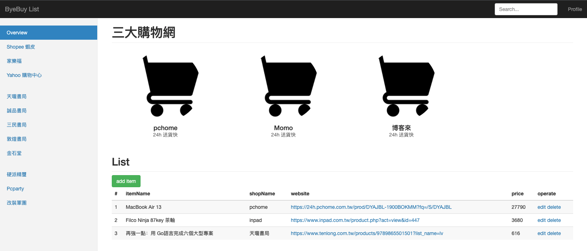
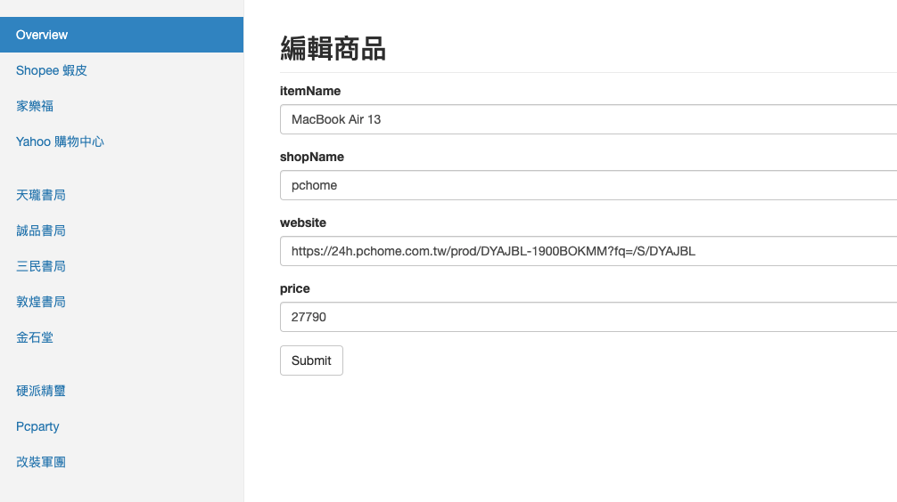

# ShoppingCart

## About The Project

使用Node.js express 模式開發後端環境

簡易的購物清單，主要功能為
1. 新增物品
   * Name
   * ShopName
   * website
   * price
2. 修改物品詳細資料
3. 刪除物品

### Build With
* Backend: Node.js
* FrontEnd: HTML, Bootstrap core CSS
    * engine: express-art-template
* DataBase: Mongodb using mongoose

### Prerequisites
`npm install package.json`

mongodb install

### Execute
`node app.js`

website:

`http://localhost:3001`

## Introduction

### Home page
按 `add Item` 可以新增新的品項

在每個品項的 operate 欄位可以選擇編輯或是刪除

主頁有常用購物網站超連結

### Edit Page

